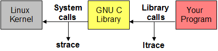

+++++++++++++++++++++++++++++++++++++++++++++++++
My journey to stable benchmark, part 2 (deadcode)
+++++++++++++++++++++++++++++++++++++++++++++++++

:date: 2016-05-22 22:00
:tags: optimization, benchmark
:category: python
:slug: journey-to-stable-benchmark-deadcode
:authors: Victor Stinner
:summary: My journey to stable benchmark, part 2 (deadcode)

.. image:: images/snail.jpg
   :alt: Snail
   :target: https://www.flickr.com/photos/uw67/16875152403/

With `the system tuning (part 1) <{filename}/stable_benchmark_system.rst>`_, I
expected to get very stable benchmarks and so I started to benchmark seriously
my `FASTCALL branch <https://bugs.python.org/issue26814>`_ of CPython (a new
calling convention avoiding temporary tuples).

I was disappointed to get many slowdowns in the CPython benchmark suite. I
started to analyze why my change introduced performance regressions.

I took my overall patch and slowly reverted more and more code to check which
changes introduced most of the slowdowns.

I focused on the ``call_simple`` benchmark which does only one thing: call
Python functions which do nothing.  Making Python function calls slower would
be a big and inacceptable mistake of my work.

Linux perf
==========

I started to learn how to use the great `Linux perf
<https://perf.wiki.kernel.org/index.php/Main_Page>`_ tool to analyze why
``call_simple`` was slower. I tried to find a major difference between my
reference python and the patched python.

I analyzed cache misses on L1 instruction and data caches.  I analyzed stallen
CPU cycles. I analyzed all memory events, branch events, etc. Basically, I tried
all perf events and spent a lot of time to run benchmarks multiple times.

By the way, I strongly suggest to use ``perf stat`` using the ``--repeat``
command line option to get an average on multiple runs and see the standard
deviation. It helps to get more reliable numbers. I even wrote a Python script
implementing ``--repeat`` (run perf multiple times, parse the output), before
seeing that it was already a builtin feature!

Use ``perf list`` to list all available (pre-defined) events.

After many days, I decided to give up with perf.

Cachegrind
==========

.. image:: images/valgrind.png
   :alt: Logo of the Valgrind project
   :target: http://valgrind.org/

`Valgrind <http://valgrind.org/>`_ is a great tool known to detect memory
leaks, but it also contains gems like the `Cachegrind tool
<http://valgrind.org/docs/manual/cg-manual.html>`_ which *simulates* the
CPU caches.

I used Cachegrind with the nice `Kcachegrind GUI
<http://kcachegrind.sourceforge.net/>`_. Sadly, I also failed to see anything
obvious in cache misses between the reference python and the patched python.

strace and ltrace
=================

I also tried ``strace`` and ``ltrace`` tools to try to see a difference in the
execution of the reference and the patched pythons. I saw different memory
addresses, but no major difference which can explain a difference of the
timing.

Morever, the hotcode simply does not call any syscall nor library
function. It's pure CPU-bound code.

Compiler options
================

.. image:: images/gcc.png
   :alt: GCC logo
   :align: right
   :target: https://gcc.gnu.org/

I used `GCC <https://gcc.gnu.org/>`_ to build to code. Just in case, I tried
LLVM compiler, but it didn't "fix" the issue.

I also tried different optimization levels: ``-O0``, ``-O1``, ``-O2`` and
``-O3``.

I read that the exact address of functions can have an impact on the CPU L1
cache: `Why does gcc generate 15-20% faster code if I optimize for size instead
of speed?
<https://stackoverflow.com/questions/19470873/why-does-gcc-generate-15-20-faster-code-if-i-optimize-for-size-instead-of-speed>`_.
I tried various values of the ``-falign-functions=N`` option (1, 2, 6, 12).

I also tried ``-fomit-pointer`` (omit frame pointer) to record the callgraph with ``perf record``.

I also tried ``-flto``: Link Time Optimization (LTO).

These compiler options didn't fix the issue.

The truth is out there.

When CPython performance depends on dead code
=============================================

I continued to revert changes. At the end, my giant patch was reduced to very
few changes only adding code which was never called (at least, I was sure
that it was not called in the ``call_simple`` benchmark).

Let me rephase: *adding dead code* makes Python slower. What?

A colleague suggested me to remove the body (replace it with ``return;``) of
added function: the code became faster. Ok, now I'm completely lost. To be
clear, I don't expect that adding dead code would have *any* impact on the
performance.

My email `When CPython performance depends on dead code...
<https://mail.python.org/pipermail/speed/2016-April/000341.html>`_ explains how
to reproduce the issue and contains many information.

Solution: PGO
=============

The solution is called Profiled Guided Optimization, "PGO". Python build system
supports it in a single command: ``make profile-opt``. It profiles the
execution of the Python test suite.

Using PGO, adding dead code has no more impact on the performance.

With system tuning and PGO compilation, benchmarks must now be stable this
time, no? ... No, sorry, not yet. We will see more sources of noise in
following articles ;-)
